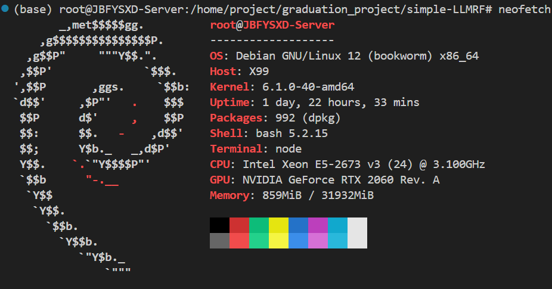

# 面向 GGUF 的 LLM 轻量级推理框架设计与实现 —— simple-LLMRF

此项目意为通过对 GGUF 格式的标准的稠密模型进行最简化推理， 来展示基本的推理框架的流程， 并展示一些基础的组件

## 测试环境

## 开发环境

## 待办事项

- [ ] GGUF文件解析器
  - [ ] 使用 mmap 进行模型文件的读取载入
  - [ ] 根据 GGUF 模型文件格式进行验证加载
  - [ ] 对于量化类型数据的反量化载入
- [ ] 构建张量系统
  - [ ] 构建基本的存储权重的张量类
  - [ ] 支持动态的视图转换操作
- [ ] 构建静态图
  - [ ] 构建基本的存储计算图间关系的静态图类
  - [ ] 通过 BFS 遍历静态图完成计算
- [ ] 核心算子库

## 编写日志

- 2026年1月16日 建库， 并编写 README.md 为项目开始做准备。